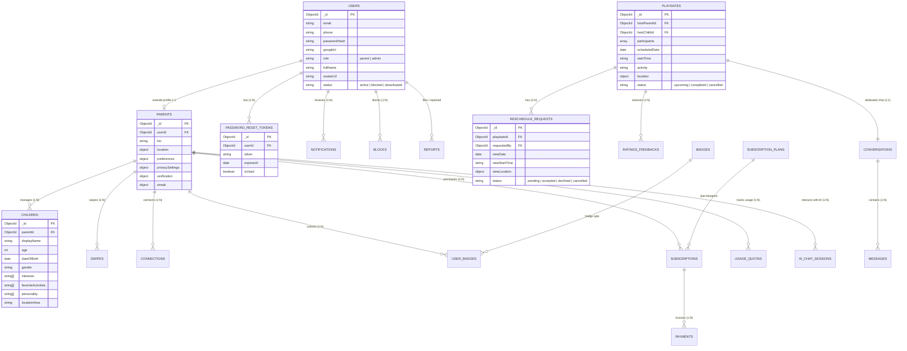

# BuddyLink Database Schema Design (MongoDB & Mongoose)

> **Dự án:** BuddyLink - AI-Powered Child Playmate Matching and Playdate Planning Platform  
> **Cơ sở dữ liệu:** MongoDB (NoSQL Document Store)  
> **Thư viện Object Modeling:** Mongoose ODM (Node.js)  
> **Căn cứ thiết kế:** Toàn bộ chức năng, quy tắc nghiệp vụ và ràng buộc trong `PROJECT_OVERVIEW.md` cùng các yêu cầu chuẩn hóa kiến trúc.

---

## 1. Kiến trúc tổng quan & Danh sách Collections

Hệ thống cơ sở dữ liệu BuddyLink được tổ chức theo chuẩn phân tách rõ ràng:
- `users`: Chứa các trường định danh và tài khoản chung của cả **Parent** và **Admin**.
- `parents`: Collection riêng biệt lưu trữ thông tin nghiệp vụ phụ huynh, khu vực địa lý, **preferences**, cấu hình quyền riêng tư, xác thực và chuỗi streak.
- `password_reset_tokens`: Collection quản lý mã token phục vụ quy trình Quên / Đặt lại mật khẩu an toàn.
- Bỏ `activityCategory` và `endTime` trong `playdates`, đồng thời bỏ `newEndTime` trong `reschedule_requests` để tối giản và linh hoạt theo lịch thực tế của gia đình.
- Cung cấp mã nguồn **DBML** sẵn sàng import vào **dbdiagram.io** để trực quan hóa diagram.

### Bảng phân mục 22 Collections:

| STT | Collection | Mô tả & Mục tiêu nghiệp vụ | Phân hệ tương ứng trong `PROJECT_OVERVIEW.md` |
|:---:|:---|:---|:---|
| 1 | `users` | Tài khoản định danh chung cho Parent và Admin | Mục 2 (Roles), 3.1 (Authentication), 15.1 (Admin User Mgmt) |
| 2 | `parents` | Hồ sơ chi tiết của phụ huynh, preferences, privacy, streak | Mục 3.2 (Parent Profile), 4.2 (Preferences), 10.1, 12.2, 13 |
| 3 | `password_reset_tokens` | Token đặt lại mật khẩu khi Forgot/Reset Password | Mục 3.1 (Password Recovery Flow) |
| 4 | `children` | Hồ sơ thông tin của trẻ em (Child Profile) | Mục 3.3 (Child Profile), 4.2 (Smart Matching) |
| 5 | `swipes` | Lịch sử tương tác thẻ khám phá (Like / Pass) của phụ huynh | Mục 4.1 (Discovery & Swipe) |
| 6 | `connections` | Quan hệ kết nối giữa các phụ huynh (Request, Accepted, Declined) | Mục 4.3 (Connection) |
| 7 | `conversations` | Phiên trò chuyện Direct 1-1 hoặc Group Playdate Chat | Mục 5.1 (Direct Chat), 5.2 (Playdate Chat) |
| 8 | `messages` | Tin nhắn chi tiết (text, image, emoji, trạng thái đã đọc) | Mục 5 (Communication) |
| 9 | `playdates` | Sự kiện gặp gỡ của các bé (không có activityCategory, endTime) | Mục 6 (Playdate: 6.1, 6.2, 6.3) |
| 10 | `reschedule_requests`| Yêu cầu đề xuất đổi lịch Playdate (không có newEndTime) | Mục 6.2 (Reschedule Request Workflow) |
| 11 | `ratings_feedbacks` | Đánh giá sao và phản hồi chất lượng Playdate sau khi hoàn thành | Mục 11 (Rating & Feedback) |
| 12 | `ai_chat_sessions` | Phiên hội thoại với AI Family Assistant và lịch sử tool calls | Mục 8 (AI Playdate Assistant Agent) |
| 13 | `badges` | Danh mục định nghĩa huy hiệu thành tích | Mục 10.2 (Badge Definition) |
| 14 | `user_badges` | Huy hiệu mà người dùng đã mở khóa được | Mục 10.2 (Unlocked Badges) |
| 15 | `notifications` | Thông báo hệ thống, tin nhắn, lời mời, huy hiệu | Mục 5.3 (Notification) |
| 16 | `subscription_plans` | Các gói cước dịch vụ (Free, Premium Monthly/Yearly) | Mục 14 (Premium Subscription), 15.5 (Admin Subscription) |
| 17 | `subscriptions` | Hợp đồng / gói đăng ký của phụ huynh | Mục 14.2 (Subscription Management) |
| 18 | `payments` | Lịch sử giao dịch thanh toán Premium | Mục 14.2 (Payment History), 15.6 (Revenue Analytics) |
| 19 | `usage_quotas` | Kiểm soát giới hạn hạn mức Free vs Premium theo ngày/tháng | Mục 14.1 (Feature Quota Limiting) |
| 20 | `reports` | Báo cáo vi phạm an toàn, người dùng, tin nhắn | Mục 12.1 (Safety), 15.4 (Admin Safety) |
| 21 | `blocks` | Danh sách phụ huynh bị chặn | Mục 4.3 & 12.1 (Block User) |
| 22 | `places_cache` | Cache thông tin địa điểm vui chơi từ Google Places API | Mục 7.2 (Nearby Places & Activity) |

---

## 2. Mermaid Entity Relationship Diagram



---

## 3. Chi tiết Cấu trúc Từng Collection & Thuộc tính (TypeScript Schemas)

### 3.1 `users` Collection (Tài khoản chung Parent & Admin)
Chỉ chứa các trường dùng chung cho quá trình xác thực và thông tin tài khoản cơ bản.

```typescript
interface IUser {
  _id: ObjectId;
  email: string;                  // Unique, indexed
  phone?: string;                 // Format E.164, indexed
  passwordHash?: string;          // bcrypt hash (null nếu đăng nhập Google)
  googleId?: string;              // Google OAuth ID (Mục 3.1)
  role: 'parent' | 'admin';       // Quyền truy cập (Default: 'parent')
  
  fullName: string;               // Họ tên hiển thị
  avatarUrl?: string;             // Ảnh đại diện (Cloud Storage URL)

  // Quản lý trạng thái tài khoản bởi Admin (Mục 15.1)
  status: 'active' | 'blocked' | 'deactivated';
  blockedReason?: string;
  blockedAt?: Date;

  createdAt: Date;
  updatedAt: Date;
}
```

*Indexes:*
- `{ email: 1 }` (unique)
- `{ phone: 1 }` (sparse)
- `{ googleId: 1 }` (sparse)
- `{ role: 1, status: 1 }`

---

### 3.2 `parents` Collection (Hồ sơ chuyên biệt của Phụ huynh)
Tách riêng khỏi `users`, liên kết 1:1 với `users` thông qua `userId`. Chứa toàn bộ nghiệp vụ đặc thù của phụ huynh, bao gồm **preferences**, vị trí địa lý, quyền riêng tư, xác thực và streak.

```typescript
interface IParentPreferences {
  preferredPlaydateDays?: ('weekday' | 'weekend')[]; // Ngày rảnh: ngày trong tuần / cuối tuần
  preferredTimeSlots?: ('morning' | 'afternoon' | 'evening')[]; // Khung giờ: sáng / chiều / tối
  preferredLocations?: ('indoor' | 'outdoor' | 'park' | 'kids_cafe' | 'home')[]; // Địa điểm ưa thích
  maxDistanceKm?: number;                            // Bán kính tìm kiếm bạn chơi tối đa (km)
  preferredAgeRange?: { min: number; max: number };  // Khoảng tuổi bạn chơi mong muốn
  languages?: string[];                              // Ngôn ngữ giao tiếp: ['Vietnamese', 'English']
  additionalNotes?: string;                          // Ghi chú phong cách nuôi dạy hoặc lưu ý riêng
}

interface IParent {
  _id: ObjectId;
  userId: ObjectId;               // Tham chiếu 1:1 users._id (Unique, Indexed)
  bio?: string;

  // Địa lý & Tọa độ (Mục 3.2, 4.2)
  location: {
    address?: string;
    area?: string;                // Quận/Huyện/Khu vực
    city?: string;                // Tỉnh/Thành phố
    coordinates?: {               // GeoJSON Point phục vụ Smart Matching và tính khoảng cách
      type: 'Point';
      coordinates: [number, number]; // [longitude, latitude]
    };
  };

  // Tiêu chí Matching & Sở thích của gia đình (Mục 4.2 Smart Matching)
  preferences: IParentPreferences;

  // Quyền riêng tư & An toàn (Mục 3.2, 12.2)
  privacySettings: {
    isProfileHidden: boolean;             // Ẩn Parent và Child khỏi Discovery (Default: false)
    connectionPrivacy: 'everyone' | 'nobody'; // Quyền nhận Connection Request (Default: 'everyone')
    messagePrivacy: 'connected_only';     // Chỉ Connected Parents mới nhắn tin (Default: 'connected_only')
  };

  // Xác thực phụ huynh (Mục 13 Verification)
  verification: {
    isEmailVerified: boolean;
    isPhoneVerified: boolean;
    phoneOtp?: string;
    phoneOtpExpires?: Date;
    isVerifiedParent: boolean;            // true khi cả Email + Phone đã verify (Hiện Verified Badge)
  };

  // Gamification: Streak hàng tuần (Mục 10.1)
  streak: {
    currentWeeklyStreak: number;          // Số tuần liên tiếp (Default: 0)
    longestStreak: number;
    lastCompletedPlaydateWeek?: string;   // Dạng 'YYYY-WW' (ví dụ: '2026-W37')
    streakUpdatedAt?: Date;
  };

  createdAt: Date;
  updatedAt: Date;
}
```

*Indexes:*
- `{ userId: 1 }` (unique)
- `{ "location.coordinates": "2dsphere" }` (hỗ trợ Geospatial `$near` tính khoảng cách)
- `{ "privacySettings.isProfileHidden": 1 }`

---

### 3.3 `password_reset_tokens` Collection (Quên & Đặt lại mật khẩu)
Quản lý mã token một lần phục vụ tính năng Forgot Password & Reset Password (Mục 3.1).

```typescript
interface IPasswordResetToken {
  _id: ObjectId;
  userId: ObjectId;               // Tham chiếu users._id
  token: string;                  // Token ngẫu nhiên (hoặc SHA-256 hash) gửi qua email
  expiresAt: Date;                // Thời điểm hết hạn (ví dụ: sau 15 - 30 phút)
  isUsed: boolean;                // Trạng thái: true nếu đã dùng để đổi mật khẩu thành công
  createdAt: Date;
}
```

*Indexes:*
- `{ token: 1 }` (unique)
- `{ userId: 1, isUsed: 1 }`
- `{ expiresAt: 1 }` (`expireAfterSeconds: 86400` - TTL Index tự dọn dẹp token cũ sau 24h)

---

### 3.4 `children` Collection (Hồ sơ Trẻ em)
*Ánh xạ: Mục 3.3, 4.2.*
```typescript
interface IChild {
  _id: ObjectId;
  parentId: ObjectId;             // Tham chiếu parents._id (Indexed)
  
  displayName: string;            // Tên hoặc biệt danh
  dateOfBirth?: Date;             // Ngày sinh để tính tuổi chính xác
  age: number;                    // Tuổi (1 - 18)
  gender: 'boy' | 'girl' | 'other';
  avatarUrl?: string;             // Ảnh của bé
  
  interests: string[];            // ['Lego', 'Vẽ tranh', 'Khủng long', 'Âm nhạc']
  favoriteActivities: string[];   // ['Đạp xe', 'Bơi lội', 'Đi công viên', 'Đọc sách']
  personality: string[];          // ['Năng động', 'Sáng tạo', 'Điềm tĩnh', 'Hòa đồng']
  
  locationArea?: string;          // Khu vực của trẻ
  bioOrNotes?: string;            // Dị ứng, lưu ý đặc biệt
  isArchived: boolean;            // Soft delete khi phụ huynh xóa hồ sơ
  
  createdAt: Date;
  updatedAt: Date;
}
```

*Indexes:*
- `{ parentId: 1, isArchived: 1 }`
- `{ age: 1, gender: 1 }`
- `{ interests: 1 }`
- `{ favoriteActivities: 1 }`

---

### 3.5 `swipes` Collection (Lịch sử Vuốt thẻ Discovery)
*Ánh xạ: Mục 4.1, 14.1.*
```typescript
interface ISwipe {
  _id: ObjectId;
  swiperParentId: ObjectId;       // Tham chiếu parents._id
  targetChildId: ObjectId;        // Tham chiếu children._id
  targetParentId: ObjectId;       // Tham chiếu parents._id của bé
  action: 'like' | 'pass';
  createdAt: Date;                // Kiểm tra giới hạn 5 profiles/ngày cho Free Plan
}
```

*Indexes:*
- `{ swiperParentId: 1, targetChildId: 1 }` (unique)
- `{ swiperParentId: 1, createdAt: 1 }`

---

### 3.6 `connections` Collection (Kết nối Bạn chơi)
*Ánh xạ: Mục 4.3.*
```typescript
interface IConnection {
  _id: ObjectId;
  requesterId: ObjectId;          // Tham chiếu parents._id gửi lời mời
  recipientId: ObjectId;          // Tham chiếu parents._id nhận lời mời
  status: 'pending' | 'accepted' | 'declined' | 'removed';
  connectedAt?: Date;
  declinedAt?: Date;
  removedAt?: Date;
  createdAt: Date;
  updatedAt: Date;
}
```

*Indexes:*
- `{ requesterId: 1, recipientId: 1 }` (unique)
- `{ recipientId: 1, status: 1 }`
- `{ requesterId: 1, createdAt: 1 }`

---

### 3.7 `conversations` & `messages` Collections (Trò chuyện)
*Ánh xạ: Mục 5.1 (Direct Chat) & 5.2 (Playdate Chat).*

```typescript
interface IConversation {
  _id: ObjectId;
  type: 'direct' | 'playdate';
  participants: ObjectId[];       // Danh sách users._id (hoặc parents._id)
  playdateId?: ObjectId;          // Tham chiếu playdates._id (nếu type === 'playdate')
  
  lastMessage?: {
    messageId: ObjectId;
    senderId: ObjectId;
    content: string;
    type: 'text' | 'image' | 'emoji' | 'system';
    sentAt: Date;
  };
  isActive: boolean;
  createdAt: Date;
  updatedAt: Date;
}

interface IMessage {
  _id: ObjectId;
  conversationId: ObjectId;       // Tham chiếu conversations._id
  senderId: ObjectId;             // Tham chiếu users._id
  type: 'text' | 'image' | 'emoji' | 'system';
  content: string;
  mediaUrl?: string;              // Cloud Storage URL
  readBy: Array<{
    userId: ObjectId;
    readAt: Date;
  }>;
  isDeleted: boolean;
  createdAt: Date;
}
```

---

### 3.8 `playdates` Collection (Sự kiện Playdate)
*Ánh xạ: Mục 6. Đã loại bỏ `activityCategory` và `endTime` theo yêu cầu.*

```typescript
interface IPlaydateParticipant {
  parentId: ObjectId;             // Tham chiếu parents._id
  childId: ObjectId;              // Tham chiếu children._id
  status: 'pending' | 'accepted' | 'declined';
  invitedAt: Date;
  respondedAt?: Date;
}

interface IPlaydate {
  _id: ObjectId;
  hostParentId: ObjectId;         // Tham chiếu parents._id
  hostChildId: ObjectId;          // Tham chiếu children._id
  participants: IPlaydateParticipant[];
  
  scheduledDate: Date;            // Ngày tổ chức
  startTime: string;              // Giờ bắt đầu (ví dụ: "09:00", "15:30")
  activity: string;               // Hoạt động: Picnic, công viên, vẽ tranh, đá bóng...
  
  location: {
    name: string;                 // "Công viên Gia Định", "TiNiWorld Landmark 81"
    address: string;
    placeId?: string;             // Google Place ID
    coordinates?: {
      type: 'Point';
      coordinates: [number, number]; // [lng, lat]
    };
  };

  note?: string;                  // Ghi chú cho các gia đình tham gia
  status: 'upcoming' | 'completed' | 'cancelled';
  
  cancellation?: {
    cancelledBy: ObjectId;
    reason?: string;
    cancelledAt: Date;
  };

  completedAt?: Date;
  chatConversationId?: ObjectId;  // Tham chiếu conversations._id (Chat riêng cho Playdate)

  createdAt: Date;
  updatedAt: Date;
}
```

*Indexes:*
- `{ hostParentId: 1, status: 1 }`
- `{ "participants.parentId": 1, status: 1 }`
- `{ scheduledDate: 1, status: 1 }`
- `{ "location.coordinates": "2dsphere" }`

---

### 3.9 `reschedule_requests` Collection (Yêu cầu Đổi lịch Playdate)
*Ánh xạ: Mục 6.2. Đã loại bỏ `newEndTime` theo yêu cầu.*

```typescript
interface IRescheduleRequest {
  _id: ObjectId;
  playdateId: ObjectId;           // Tham chiếu playdates._id
  requestedBy: ObjectId;          // Tham chiếu parents._id
  
  newDate: Date;                  // Ngày mới đề xuất
  newStartTime: string;           // Giờ mới đề xuất
  newLocation?: {
    name: string;
    address: string;
    placeId?: string;
    coordinates?: {
      type: 'Point';
      coordinates: [number, number];
    };
  };
  reason?: string;

  // Trạng thái theo quy tắc Mục 6.2: Cần tất cả Accepted Participants đồng ý
  status: 'pending' | 'accepted' | 'declined' | 'cancelled';
  
  responses: Array<{
    parentId: ObjectId;           // Tham chiếu parents._id
    status: 'pending' | 'accepted' | 'declined';
    respondedAt?: Date;
  }>;

  resolvedAt?: Date;
  createdAt: Date;
  updatedAt: Date;
}
```

*Indexes:*
- `{ playdateId: 1, status: 1 }`
- `{ requestedBy: 1 }`

---

### 3.10 `ratings_feedbacks` Collection (Đánh giá Playdate)
*Ánh xạ: Mục 11.*
```typescript
interface IRatingFeedback {
  _id: ObjectId;
  playdateId: ObjectId;           // Tham chiếu playdates._id
  parentId: ObjectId;             // Tham chiếu parents._id
  rating: number;                 // 1 - 5 ⭐
  feedback?: string;
  tags?: string[];
  createdAt: Date;
}
```
*Indexes:*
- `{ playdateId: 1, parentId: 1 }` (unique: 1 đánh giá / phụ huynh / playdate)

---

### 3.11 `ai_chat_sessions` Collection (AI Assistant Agent)
*Ánh xạ: Mục 8.*
```typescript
interface IAIChatSession {
  _id: ObjectId;
  parentId: ObjectId;             // Tham chiếu parents._id
  title: string;
  messages: Array<{
    role: 'user' | 'assistant' | 'system' | 'tool';
    content: string;
    toolCalls?: Array<{
      id: string;
      type: 'function';
      function: {
        name: string;
        arguments: string;
      };
    }>;
    toolCallId?: string;
    timestamp: Date;
  }>;
  tokenUsage?: {
    promptTokens: number;
    completionTokens: number;
    totalTokens: number;
  };
  isActive: boolean;
  createdAt: Date;
  updatedAt: Date;
}
```

---

### 3.12 `badges` & `user_badges` Collections (Gamification)
*Ánh xạ: Mục 10.2.*
```typescript
interface IBadge {
  _id: ObjectId;
  code: string;                   // 'first_connection', 'first_playdate', '4_week_streak', '10_playdates', 'social_family', 'explorer'
  title: string;
  description: string;
  iconUrl: string;
  requirementCount: number;
}

interface IUserBadge {
  _id: ObjectId;
  parentId: ObjectId;             // Tham chiếu parents._id
  badgeCode: string;              // Tham chiếu badges.code
  unlockedAt: Date;               // Mở khóa vĩnh viễn
}
```

---

### 3.13 `notifications`, `blocks`, `reports`, `places_cache` Collections
- **`notifications` (Mục 5.3):** Lưu thông báo theo `recipientId` (ref `users`), `type`, `title`, `body`, `data`, `isRead`.
- **`blocks` (Mục 12.1):** Lưu `blockerId` (ref `users`), `blockedId` (ref `users`).
- **`reports` (Mục 12.1 & 15.4):** Lưu `reporterId`, `reportedUserId`, `targetType` ('user' | 'message' | 'playdate'), `targetMessageId`, `targetPlaydateId`, `reason`, `evidenceUrls`, `status: pending/reviewing/resolved/dismissed`.
- **`places_cache` (Mục 7.2):** Lưu cache Google Places API: `googlePlaceId`, `name`, `address`, `location` (Point), `placeType`, `rating`, `userRatingsTotal`, `lastFetchedAt`.

---

### 3.14 `subscription_plans`, `subscriptions`, `payments` & `usage_quotas`
- **`subscription_plans` (Mục 14 & 15.5):** Gói cước `planCode` ('free', 'premium_monthly', 'premium_yearly'), `price`, `billingCycle`, `features`.
- **`subscriptions`:** `parentId` (ref `parents`), `planCode`, `status: active/cancelled/expired`, `startDate`, `endDate`, `autoRenew`.
- **`payments`:** `subscriptionId`, `parentId`, `amount`, `paymentMethod`, `transactionId`, `status`.
- **`usage_quotas`:** `parentId`, `monthPeriod` (YYYY-MM), `dayPeriod` (YYYY-MM-DD):
  - `discoveryViewCountToday` (Free: max 5/ngày)
  - `connectionRequestsThisMonth` (Free: max 5/tháng)
  - `playdatesCreatedThisMonth` (Free: max 3/tháng)
  - `playdatesJoinedThisMonth` (Free: max 3/tháng)
  - `aiAssistantRequestsThisMonth` (Free: max 5/tháng)

---

## 4. Mã nguồn DBML dùng cho `dbdiagram.io`

Bạn chỉ cần sao chép toàn bộ khối code bên dưới và dán trực tiếp vào trình biên tập của [dbdiagram.io](https://dbdiagram.io) để tạo schema diagram tự động:

```dbml
// ============================================================
// BUDDYLINK DATABASE SCHEMA DIAGRAM (DBML for dbdiagram.io)
// AI-Powered Child Playmate Matching & Playdate Platform
// ============================================================

Table users {
  _id ObjectId [pk]
  email varchar [unique, not null]
  phone varchar
  passwordHash varchar
  googleId varchar
  role varchar [note: 'parent | admin', default: 'parent']
  fullName varchar [not null]
  avatarUrl varchar
  status varchar [note: 'active | blocked | deactivated', default: 'active']
  blockedReason varchar
  blockedAt timestamp
  createdAt timestamp
  updatedAt timestamp
}

Table parents {
  _id ObjectId [pk]
  userId ObjectId [unique, not null, note: '1:1 relation with users']
  bio text
  address varchar
  area varchar
  city varchar
  locationCoordinates json [note: 'GeoJSON Point: [lng, lat]']
  preferences json [note: 'preferredPlaydateDays, timeSlots, locations, maxDistanceKm, ageRange, languages']
  isProfileHidden boolean [default: false]
  connectionPrivacy varchar [note: 'everyone | nobody', default: 'everyone']
  messagePrivacy varchar [note: 'connected_only', default: 'connected_only']
  isEmailVerified boolean [default: false]
  isPhoneVerified boolean [default: false]
  isVerifiedParent boolean [default: false]
  phoneOtp varchar
  phoneOtpExpires timestamp
  currentWeeklyStreak int [default: 0]
  longestStreak int [default: 0]
  lastCompletedPlaydateWeek varchar [note: 'YYYY-WW']
  streakUpdatedAt timestamp
  createdAt timestamp
  updatedAt timestamp
}

Table password_reset_tokens {
  _id ObjectId [pk]
  userId ObjectId [not null]
  token varchar [unique, not null]
  expiresAt timestamp [not null]
  isUsed boolean [default: false]
  createdAt timestamp
}

Table children {
  _id ObjectId [pk]
  parentId ObjectId [not null]
  displayName varchar [not null]
  dateOfBirth date
  age int [not null]
  gender varchar [note: 'boy | girl | other']
  avatarUrl varchar
  interests varchar[] [note: 'Array of interests']
  favoriteActivities varchar[] [note: 'Array of activities']
  personality varchar[] [note: 'Array of personality traits']
  locationArea varchar
  bioOrNotes text
  isArchived boolean [default: false]
  createdAt timestamp
  updatedAt timestamp
}

Table swipes {
  _id ObjectId [pk]
  swiperParentId ObjectId [not null]
  targetChildId ObjectId [not null]
  targetParentId ObjectId [not null]
  action varchar [note: 'like | pass']
  createdAt timestamp
}

Table connections {
  _id ObjectId [pk]
  requesterId ObjectId [not null]
  recipientId ObjectId [not null]
  status varchar [note: 'pending | accepted | declined | removed']
  connectedAt timestamp
  declinedAt timestamp
  removedAt timestamp
  createdAt timestamp
  updatedAt timestamp
}

Table conversations {
  _id ObjectId [pk]
  type varchar [note: 'direct | playdate']
  participants ObjectId[] [note: 'Array of user IDs']
  playdateId ObjectId [note: 'Optional, 1:1 if playdate chat']
  lastMessage json
  isActive boolean [default: true]
  createdAt timestamp
  updatedAt timestamp
}

Table messages {
  _id ObjectId [pk]
  conversationId ObjectId [not null]
  senderId ObjectId [not null]
  type varchar [note: 'text | image | emoji | system']
  content text
  mediaUrl varchar
  readBy json [note: 'Array of { userId, readAt }']
  isDeleted boolean [default: false]
  createdAt timestamp
}

Table playdates {
  _id ObjectId [pk]
  hostParentId ObjectId [not null]
  hostChildId ObjectId [not null]
  participants json [note: 'Array of { parentId, childId, status, invitedAt, respondedAt }']
  scheduledDate date [not null]
  startTime varchar [not null, note: 'e.g. 09:30']
  activity varchar [not null]
  locationName varchar
  locationAddress varchar
  locationPlaceId varchar
  locationCoordinates json [note: 'GeoJSON Point']
  note text
  status varchar [note: 'upcoming | completed | cancelled', default: 'upcoming']
  cancellation json [note: '{ cancelledBy, reason, cancelledAt }']
  completedAt timestamp
  chatConversationId ObjectId
  createdAt timestamp
  updatedAt timestamp
}

Table reschedule_requests {
  _id ObjectId [pk]
  playdateId ObjectId [not null]
  requestedBy ObjectId [not null]
  newDate date [not null]
  newStartTime varchar [not null]
  newLocation json [note: '{ name, address, placeId, coordinates }']
  reason varchar
  status varchar [note: 'pending | accepted | declined | cancelled']
  responses json [note: 'Array of { parentId, status, respondedAt }']
  resolvedAt timestamp
  createdAt timestamp
  updatedAt timestamp
}

Table ratings_feedbacks {
  _id ObjectId [pk]
  playdateId ObjectId [not null]
  parentId ObjectId [not null]
  rating int [note: '1 to 5 stars']
  feedback text
  tags varchar[]
  createdAt timestamp
}

Table ai_chat_sessions {
  _id ObjectId [pk]
  parentId ObjectId [not null]
  title varchar
  messages json [note: 'Array of { role, content, toolCalls, toolCallId, timestamp }']
  tokenUsage json
  isActive boolean [default: true]
  createdAt timestamp
  updatedAt timestamp
}

Table badges {
  _id ObjectId [pk]
  code varchar [unique, not null]
  title varchar [not null]
  description text
  iconUrl varchar
  requirementCount int
}

Table user_badges {
  _id ObjectId [pk]
  parentId ObjectId [not null]
  badgeCode varchar [not null]
  unlockedAt timestamp
}

Table notifications {
  _id ObjectId [pk]
  recipientId ObjectId [not null]
  type varchar [note: 'message_new | connection_request | playdate_invitation | badge_unlocked | streak_reminder...']
  title varchar
  body text
  data json [note: '{ playdateId, senderId, conversationId, badgeCode }']
  isRead boolean [default: false]
  readAt timestamp
  createdAt timestamp
}

Table subscription_plans {
  _id ObjectId [pk]
  planCode varchar [unique, not null, note: 'free | premium_monthly | premium_yearly']
  name varchar
  price int
  currency varchar [default: 'VND']
  billingCycle varchar [note: 'monthly | yearly | none']
  features json [note: 'maxChildren, discoveryLimit, connectionLimit, playdateLimit, aiLimit']
  isActive boolean [default: true]
}

Table subscriptions {
  _id ObjectId [pk]
  parentId ObjectId [not null]
  planCode varchar [not null]
  status varchar [note: 'active | cancelled | expired | trial']
  startDate timestamp
  endDate timestamp
  autoRenew boolean [default: true]
  cancelledAt timestamp
  createdAt timestamp
  updatedAt timestamp
}

Table payments {
  _id ObjectId [pk]
  subscriptionId ObjectId [not null]
  parentId ObjectId [not null]
  amount int
  currency varchar [default: 'VND']
  paymentMethod varchar [note: 'momo | vnpay | zalopay | stripe']
  transactionId varchar [unique]
  status varchar [note: 'pending | success | failed']
  paidAt timestamp
  createdAt timestamp
}

Table usage_quotas {
  _id ObjectId [pk]
  parentId ObjectId [not null]
  monthPeriod varchar [note: 'YYYY-MM']
  dayPeriod varchar [note: 'YYYY-MM-DD']
  discoveryViewCountToday int [default: 0]
  connectionRequestsThisMonth int [default: 0]
  playdatesCreatedThisMonth int [default: 0]
  playdatesJoinedThisMonth int [default: 0]
  aiAssistantRequestsThisMonth int [default: 0]
  updatedAt timestamp
}

Table reports {
  _id ObjectId [pk]
  reporterId ObjectId [not null]
  reportedUserId ObjectId [not null]
  targetType varchar [note: 'user | message | playdate']
  targetMessageId ObjectId
  targetPlaydateId ObjectId
  reason varchar
  description text
  evidenceUrls varchar[]
  status varchar [note: 'pending | reviewing | resolved | dismissed', default: 'pending']
  adminNotes text
  resolvedBy ObjectId
  resolvedAt timestamp
  createdAt timestamp
  updatedAt timestamp
}

Table blocks {
  _id ObjectId [pk]
  blockerId ObjectId [not null]
  blockedId ObjectId [not null]
  reason varchar
  createdAt timestamp
}

Table places_cache {
  _id ObjectId [pk]
  googlePlaceId varchar [unique, not null]
  name varchar
  address varchar
  coordinates json [note: 'GeoJSON Point']
  placeType varchar [note: 'park | kids_cafe | playground | library | sports_center | workshop']
  rating float
  userRatingsTotal int
  lastFetchedAt timestamp
}

// ============================================================
// RELATIONSHIPS (REFERENCES)
// ============================================================

// User & Auth Relations
Ref: parents.userId - users._id
Ref: password_reset_tokens.userId > users._id
Ref: notifications.recipientId > users._id
Ref: blocks.blockerId > users._id
Ref: blocks.blockedId > users._id
Ref: reports.reporterId > users._id
Ref: reports.reportedUserId > users._id
Ref: reports.resolvedBy > users._id
Ref: messages.senderId > users._id

// Parent Specific Relations
Ref: children.parentId > parents._id
Ref: swipes.swiperParentId > parents._id
Ref: swipes.targetParentId > parents._id
Ref: swipes.targetChildId > children._id
Ref: connections.requesterId > parents._id
Ref: connections.recipientId > parents._id
Ref: user_badges.parentId > parents._id
Ref: user_badges.badgeCode > badges.code
Ref: subscriptions.parentId > parents._id
Ref: subscriptions.planCode > subscription_plans.planCode
Ref: payments.subscriptionId > subscriptions._id
Ref: payments.parentId > parents._id
Ref: usage_quotas.parentId > parents._id
Ref: ai_chat_sessions.parentId > parents._id

// Playdate & Communication Relations
Ref: playdates.hostParentId > parents._id
Ref: playdates.hostChildId > children._id
Ref: reschedule_requests.playdateId > playdates._id
Ref: reschedule_requests.requestedBy > parents._id
Ref: ratings_feedbacks.playdateId > playdates._id
Ref: ratings_feedbacks.parentId > parents._id
Ref: conversations.playdateId - playdates._id
Ref: messages.conversationId > conversations._id
```
