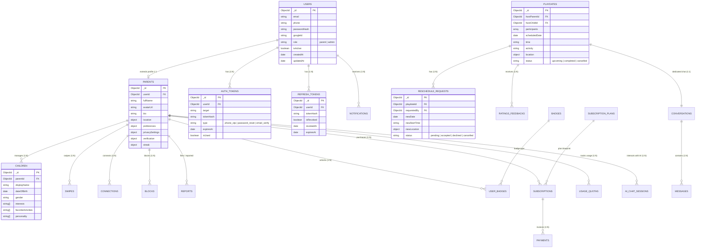

# BuddyLink Database Schema Design (MongoDB & Mongoose)

> **Dự án:** BuddyLink - AI-Powered Child Playmate Matching and Playdate Planning Platform  
> **Cơ sở dữ liệu:** MongoDB (NoSQL Document Store)  
> **Thư viện Object Modeling:** Mongoose ODM (Node.js)  
> **Căn cứ thiết kế:** Toàn bộ chức năng, quy tắc nghiệp vụ và ràng buộc trong `PROJECT_OVERVIEW.md` cùng các yêu cầu chuẩn hóa kiến trúc.

---

## 1. Kiến trúc tổng quan & Danh sách Collections

Hệ thống cơ sở dữ liệu BuddyLink được tổ chức theo chuẩn phân tách rõ ràng:

- `users`: Chứa các trường định danh và tài khoản chung của cả **Parent** và **Admin**.
- `parents`: Collection riêng biệt lưu trữ thông tin nghiệp vụ phụ huynh, khu vực địa lý, **preferences**, cấu hình quyền riêng tư, xác thực và chuỗi streak.
- `auth_tokens`: Collection quản lý mã OTP và token xác thực dùng 1 lần (Phone OTP, Password Reset, Email Verification) tự hủy theo TTL Index.
- `refresh_tokens`: Collection quản lý phiên đăng nhập và cấp lại access token an toàn.
- Bỏ `activityCategory` và `endTime` trong `playdates`, đồng thời bỏ `newEndTime` trong `reschedule_requests` để tối giản và linh hoạt theo lịch thực tế của gia đình.
- Cung cấp mã nguồn **DBML** sẵn sàng import vào **dbdiagram.io** để trực quan hóa diagram.

### Bảng phân mục 23 Collections:

| STT | Collection            | Mô tả & Mục tiêu nghiệp vụ                                        | Phân hệ tương ứng trong `PROJECT_OVERVIEW.md`               |
| :-: | :-------------------- | :---------------------------------------------------------------- | :---------------------------------------------------------- |
|  1  | `users`               | Tài khoản định danh chung cho Parent và Admin                     | Mục 2 (Roles), 3.1 (Authentication), 15.1 (Admin User Mgmt) |
|  2  | `parents`             | Hồ sơ chi tiết của phụ huynh, preferences, privacy, streak        | Mục 3.2 (Parent Profile), 4.2 (Preferences), 10.1, 12.2, 13 |
|  3  | `auth_tokens`         | OTP điện thoại, token đặt lại mật khẩu, xác thực email dùng 1 lần | Mục 3.1 (Password Recovery), 13 (Phone Verification)        |
|  4  | `refresh_tokens`      | Quản lý phiên đăng nhập và cấp lại access token                   | Mục 3.1 (Authentication & Session Management)               |
|  5  | `children`            | Hồ sơ thông tin của trẻ em (Child Profile)                        | Mục 3.3 (Child Profile), 4.2 (Smart Matching)               |
|  6  | `swipes`              | Lịch sử tương tác thẻ khám phá (Like / Pass) của phụ huynh        | Mục 4.1 (Discovery & Swipe)                                 |
|  7  | `connections`         | Quan hệ kết nối giữa các phụ huynh (Request, Accepted, Declined)  | Mục 4.3 (Connection)                                        |
|  8  | `conversations`       | Phiên trò chuyện Direct 1-1 hoặc Group Playdate Chat              | Mục 5.1 (Direct Chat), 5.2 (Playdate Chat)                  |
|  9  | `messages`            | Tin nhắn chi tiết (text, image, emoji, trạng thái đã đọc)         | Mục 5 (Communication)                                       |
| 10  | `playdates`           | Sự kiện gặp gỡ của các bé (không có activityCategory, endTime)    | Mục 6 (Playdate: 6.1, 6.2, 6.3)                             |
| 11  | `reschedule_requests` | Yêu cầu đề xuất đổi lịch Playdate (không có newEndTime)           | Mục 6.2 (Reschedule Request Workflow)                       |
| 12  | `ratings_feedbacks`   | Đánh giá sao và phản hồi chất lượng Playdate sau khi hoàn thành   | Mục 11 (Rating & Feedback)                                  |
| 13  | `ai_chat_sessions`    | Phiên hội thoại với AI Family Assistant và lịch sử tool calls     | Mục 8 (AI Playdate Assistant Agent)                         |
| 14  | `badges`              | Danh mục định nghĩa huy hiệu thành tích                           | Mục 10.2 (Badge Definition)                                 |
| 15  | `user_badges`         | Huy hiệu mà người dùng đã mở khóa được                            | Mục 10.2 (Unlocked Badges)                                  |
| 16  | `notifications`       | Thông báo hệ thống, tin nhắn, lời mời, huy hiệu                   | Mục 5.3 (Notification)                                      |
| 17  | `subscription_plans`  | Các gói cước dịch vụ (Free, Premium Monthly/Yearly)               | Mục 14 (Premium Subscription), 15.5 (Admin Subscription)    |
| 18  | `subscriptions`       | Hợp đồng / gói đăng ký của phụ huynh                              | Mục 14.2 (Subscription Management)                          |
| 19  | `payments`            | Lịch sử giao dịch thanh toán Premium                              | Mục 14.2 (Payment History), 15.6 (Revenue Analytics)        |
| 20  | `usage_quotas`        | Kiểm soát giới hạn hạn mức Free vs Premium theo ngày/tháng        | Mục 14.1 (Feature Quota Limiting)                           |
| 21  | `reports`             | Báo cáo vi phạm an toàn, người dùng, tin nhắn                     | Mục 12.1 (Safety), 15.4 (Admin Safety)                      |
| 22  | `blocks`              | Danh sách phụ huynh bị chặn                                       | Mục 4.3 & 12.1 (Block User)                                 |
| 23  | `places_cache`        | Cache thông tin địa điểm vui chơi từ Google Places API            | Mục 7.2 (Nearby Places & Activity)                          |

---

## 2. Mermaid Entity Relationship Diagram



---

## 3. Chi tiết Cấu trúc Từng Collection & Thuộc tính (TypeScript Schemas)

### 3.1 `users` Collection (Tài khoản chung Parent & Admin)

Chỉ chứa các trường dùng chung cho quá trình xác thực và thông tin tài khoản cơ bản.

```typescript
interface IUser {
  _id: ObjectId;
  email: string; // Unique, indexed
  phone?: string; // Format E.164, indexed
  passwordHash?: string; // bcrypt hash (null nếu đăng nhập Google)
  googleId?: string; // Google OAuth ID (Mục 3.1)
  role: "parent" | "admin"; // Quyền truy cập (Default: 'parent')
  // Quản lý trạng thái tài khoản bởi Admin (Mục 15.1)
  isActive: Boolean;
  createdAt: Date;
  updatedAt: Date;
}
```

_Indexes:_

- `{ email: 1 }` (unique)
- `{ phone: 1 }` (sparse)
- `{ googleId: 1 }` (sparse)
- `{ role: 1, isActive: 1 }`

---

### 3.2 `parents` Collection (Hồ sơ chuyên biệt của Phụ huynh)

Tách riêng khỏi `users`, liên kết 1:1 với `users` thông qua `userId`. Chứa toàn bộ nghiệp vụ đặc thù của phụ huynh, bao gồm **preferences**, vị trí địa lý, quyền riêng tư, xác thực và streak.

```typescript
interface IParentPreferences {
  preferredPlaydateDays?: ("weekday" | "weekend")[]; // Ngày rảnh: ngày trong tuần / cuối tuần
  preferredTimeSlots?: ("morning" | "afternoon" | "evening")[]; // Khung giờ: sáng / chiều / tối
  preferredLocations?: ("indoor" | "outdoor" | "park" | "kids_cafe" | "home")[]; // Địa điểm ưa thích
  maxDistanceKm?: number; // Bán kính tìm kiếm bạn chơi tối đa (km)
  preferredAgeRange?: { min: number; max: number }; // Khoảng tuổi bạn chơi mong muốn
  languages?: string[]; // Ngôn ngữ giao tiếp: ['Vietnamese', 'English']
  additionalNotes?: string; // Ghi chú phong cách nuôi dạy hoặc lưu ý riêng
}

interface IParent {
  _id: ObjectId;
  userId: ObjectId; // Tham chiếu 1:1 users._id (Unique, Indexed)
  fullName: string; // Họ tên hiển thị
  avatarUrl?: string; // Ảnh đại diện (Cloud Storage URL)
  bio?: string;

  // Địa lý & Tọa độ (Mục 3.2, 4.2)
  location: {
    address?: string;
    area?: string; // Quận/Huyện/Khu vực
    city?: string; // Tỉnh/Thành phố
    coordinates?: {
      // GeoJSON Point phục vụ Smart Matching và tính khoảng cách
      type: "Point";
      coordinates: [number, number]; // [longitude, latitude]
    };
  };

  // Tiêu chí Matching & Sở thích của gia đình (Mục 4.2 Smart Matching)
  preferences: IParentPreferences;

  // Quyền riêng tư & An toàn (Mục 3.2, 12.2)
  privacySettings: {
    isProfileHidden: boolean; // Ẩn Parent và Child khỏi Discovery (Default: false)
    connectionPrivacy: "everyone" | "nobody"; // Quyền nhận Connection Request (Default: 'everyone')
    messagePrivacy: "connected_only"; // Chỉ Connected Parents mới nhắn tin (Default: 'connected_only')
  };

  // Xác thực phụ huynh (Mục 13 Verification)
  verification: {
    isEmailVerified: boolean;
    isPhoneVerified: boolean;
    isVerifiedParent: boolean; // true khi cả Email + Phone đã verify (Hiện Verified Badge)
  };

  // Gamification: Streak hàng tuần (Mục 10.1)
  streak: {
    currentWeeklyStreak: number; // Số tuần liên tiếp (Default: 0)
    longestStreak: number;
    lastCompletedPlaydateWeek?: string; // Dạng 'YYYY-WW' (ví dụ: '2026-W37')
    streakUpdatedAt?: Date;
  };

  createdAt: Date;
  updatedAt: Date;
}
```

_Indexes:_

- `{ userId: 1 }` (unique)
- `{ "location.coordinates": "2dsphere" }` (hỗ trợ Geospatial `$near` tính khoảng cách)
- `{ "privacySettings.isProfileHidden": 1 }`

---

### 3.3 `auth_tokens` Collection (OTP & Xác thực dùng 1 lần)

Quản lý tất cả các mã OTP và mã xác thực tạm thời dùng 1 lần: Phone OTP (Mục 13), Password Reset Token (Mục 3.1), Email Verification Token,...

```typescript
interface IAuthToken {
  _id: ObjectId;
  userId?: ObjectId; // Tham chiếu users._id (nếu xác định được user)
  target: string; // Email hoặc Số điện thoại (ví dụ: "+84987654321" hoặc "parent@gmail.com")
  tokenHash: string; // Hash của mã OTP hoặc token ngẫu nhiên (SHA-256 / bcrypt)
  type: "phone_otp" | "password_reset" | "email_verify"; // Mục đích xác thực
  isUsed: boolean; // Trạng thái: true nếu đã xác thực thành công (Default: false)
  expiresAt: Date; // Thời điểm hết hạn (OTP: 3-5 phút, Reset token: 15-30 phút)
  createdAt: Date;
}
```

_Indexes:_

- `{ target: 1, type: 1 }`
- `{ tokenHash: 1 }`
- `{ expiresAt: 1 }` (`expireAfterSeconds: 0` - TTL Index tự động xóa token khi hết hạn)

---

### 3.4 `refresh_tokens` Collection (Phiên đăng nhập & Cấp lại Access Token)

Quản lý refresh token để duy trì phiên đăng nhập bảo mật và cấp lại access token (Mục 3.1).

```typescript
interface IRefreshToken {
  _id: ObjectId;
  userId: ObjectId; // Tham chiếu users._id
  tokenHash: string; // Hash của Refresh Token (SHA-256)
  isRevoked: boolean; // true nếu token đã bị thu hồi/đăng xuất (Default: false)
  revokedAt?: Date; // Thời điểm thu hồi/đăng xuất
  expiresAt: Date; // Hạn dùng của refresh token (ví dụ: 30 ngày)
  createdAt: Date;
  updatedAt: Date;
}
```

_Indexes:_

- `{ tokenHash: 1 }` (unique)
- `{ userId: 1, isRevoked: 1 }`
- `{ expiresAt: 1 }` (`expireAfterSeconds: 0` - TTL Index tự động xóa token khi hết hạn)

---

### 3.5 `children` Collection (Hồ sơ Trẻ em)

_Ánh xạ: Mục 3.3, 4.2._

```typescript
interface IChild {
  _id: ObjectId;
  parentId: ObjectId; // Tham chiếu parents._id (Indexed)

  displayName: string; // Tên hoặc biệt danh
  dateOfBirth: Date; // Ngày sinh để tính tuổi chính xác
  gender: "boy" | "girl" | "other";
  avatarUrl?: string; // Ảnh của bé

  interests: string[]; // ['Lego', 'Vẽ tranh', 'Khủng long', 'Âm nhạc']
  favoriteActivities: string[]; // ['Đạp xe', 'Bơi lội', 'Đi công viên', 'Đọc sách']
  personality: string[]; // ['Năng động', 'Sáng tạo', 'Điềm tĩnh', 'Hòa đồng']
  isArchived: boolean; // Soft delete khi phụ huynh xóa hồ sơ

  createdAt: Date;
  updatedAt: Date;
}
```

_Indexes:_

- `{ parentId: 1, isArchived: 1 }`
- `{ dateOfBirth: 1, gender: 1 }`
- `{ interests: 1 }`
- `{ favoriteActivities: 1 }`

---

### 3.6 `swipes` Collection (Lịch sử Vuốt thẻ Discovery)

_Ánh xạ: Mục 4.1, 14.1._

```typescript
interface ISwipe {
  _id: ObjectId;
  swiperParentId: ObjectId; // Tham chiếu parents._id
  targetChildId: ObjectId; // Tham chiếu children._id
  targetParentId: ObjectId; // Tham chiếu parents._id của bé
  isLike: boolean; // true: Like, false: Pass
  createdAt: Date; // Kiểm tra giới hạn 5 profiles/ngày cho Free Plan
}
```

_Indexes:_

- `{ swiperParentId: 1, targetChildId: 1 }` (unique)
- `{ swiperParentId: 1, createdAt: 1 }`

---

### 3.7 `connections` Collection (Kết nối Bạn chơi)

_Ánh xạ: Mục 4.3._

```typescript
interface IConnection {
  _id: ObjectId;
  parents: [ObjectId, ObjectId]; // Mảng 2 phần tử luôn được sort [minId, maxId] để triệt tiêu bài toán đảo chiều (Reverse Duplicate)
  requesterId: ObjectId; // Tham chiếu parents._id gửi lời mời
  recipientId: ObjectId; // Tham chiếu parents._id nhận lời mời
  status: "pending" | "accepted" | "declined" | "removed";
  connectedAt?: Date;
  declinedAt?: Date;
  removedAt?: Date;
  createdAt: Date;
  updatedAt: Date;
}
```

_Indexes:_

- `{ parents: 1 }` (unique, `partialFilterExpression: { status: { $in: ["pending", "accepted"] } }` - Chống trùng 2 chiều khi đang chờ hoặc đã kết nối; cho phép gửi lại nếu bị `declined` hoặc `removed`)
- `{ parents: 1, status: 1 }` (Tìm danh sách bạn bè / trạng thái quan hệ 2 chiều cực nhanh)
- `{ recipientId: 1, status: 1 }` (Lấy danh sách lời mời kết nối đang chờ duyệt)
- `{ requesterId: 1, createdAt: 1 }` (Kiểm tra quota gửi request trong tháng)

---

### 3.8 `conversations` & `messages` Collections (Trò chuyện)

_Ánh xạ: Mục 5.1 (Direct Chat) & 5.2 (Playdate Chat)._

```typescript
interface IConversation {
  _id: ObjectId;
  type: "direct" | "playdate";
  participants: ObjectId[]; // Danh sách parents._id (Socket.IO Room = conversation._id)
  playdateId?: ObjectId; // Tham chiếu playdates._id (nếu type === 'playdate')

  lastMessage?: {
    messageId: ObjectId;
    senderId: ObjectId; // Tham chiếu parents._id
    content: string;
    type: "text" | "image" | "emoji" | "system";
    sentAt: Date;
  };

  // Quản lý số tin chưa đọc tức thì cho Socket.IO badge UI
  unreadCounts?: Record<string, number>; // Key: parentId (string), Value: số tin chưa đọc

  isActive: boolean;
  createdAt: Date;
  updatedAt: Date;
}

interface IMessage {
  _id: ObjectId;
  conversationId: ObjectId; // Tham chiếu conversations._id (Socket Room)
  senderId: ObjectId; // Tham chiếu parents._id
  type: "text" | "image" | "emoji" | "system";
  content: string;
  mediaUrl?: string; // Cloud Storage URL (nếu gửi hình ảnh)

  // Quản lý trạng thái đã xem qua Socket.IO (Event: 'message_read')
  readBy: Array<{
    parentId: ObjectId; // Tham chiếu parents._id
    readAt: Date;
  }>;

  isDeleted: boolean; // Thu hồi tin nhắn (Socket.IO Event: 'message_deleted')
  createdAt: Date;
}
```

_Indexes:_

- `conversations`: `{ participants: 1, updatedAt: -1 }` (Load danh sách chat gần nhất)
- `messages`: `{ conversationId: 1, createdAt: -1 }` (Phân trang lịch sử chat mượt mà cho Socket.IO)

---

### 3.9 `playdates` Collection (Sự kiện Playdate)

_Ánh xạ: Mục 6. Đã loại bỏ `activityCategory` và `endTime` theo yêu cầu._

```typescript
interface IPlaydateParticipant {
  parentId: ObjectId; // Tham chiếu parents._id
  childId: ObjectId; // Tham chiếu children._id
  status: "pending" | "accepted" | "declined";
  invitedAt: Date;
  respondedAt?: Date;
}

interface IPlaydate {
  _id: ObjectId;
  hostParentId: ObjectId; // Tham chiếu parents._id
  hostChildId: ObjectId; // Tham chiếu children._id
  participants: IPlaydateParticipant[];

  scheduledDate: Date; // Ngày tổ chức
  time: string; // Giờ bắt đầu (ví dụ: "09:00", "15:30")
  activity: string; // Hoạt động: Picnic, công viên, vẽ tranh, đá bóng...

  location: {
    name: string; // "Công viên Gia Định", "TiNiWorld Landmark 81"
    address: string;
    placeId?: string; // Google Place ID
    coordinates?: {
      type: "Point";
      coordinates: [number, number]; // [lng, lat]
    };
  };

  note?: string; // Ghi chú cho các gia đình tham gia
  status: "upcoming" | "completed" | "cancelled";

  cancellation?: {
    cancelledBy: ObjectId;
    reason?: string;
    cancelledAt: Date;
  };

  completedAt?: Date;
  chatConversationId?: ObjectId; // Tham chiếu conversations._id (Chat riêng cho Playdate)

  createdAt: Date;
  updatedAt: Date;
}
```

_Indexes:_

- `{ hostParentId: 1, status: 1 }`
- `{ "participants.parentId": 1, status: 1 }`
- `{ scheduledDate: 1, status: 1 }`
- `{ "location.coordinates": "2dsphere" }`

---

### 3.10 `reschedule_requests` Collection (Yêu cầu Đổi lịch Playdate)

_Ánh xạ: Mục 6.2. Đã loại bỏ `newEndTime` theo yêu cầu._

```typescript
interface IRescheduleRequest {
  _id: ObjectId;
  playdateId: ObjectId; // Tham chiếu playdates._id
  requestedBy: ObjectId; // Tham chiếu parents._id

  newDate: Date; // Ngày mới đề xuất
  newStartTime: string; // Giờ mới đề xuất
  newLocation?: {
    name: string;
    address: string;
    placeId?: string;
    coordinates?: {
      type: "Point";
      coordinates: [number, number];
    };
  };
  reason?: string;

  // Trạng thái theo quy tắc Mục 6.2: Cần tất cả Accepted Participants đồng ý
  status: "pending" | "accepted" | "declined" | "cancelled";

  responses: Array<{
    parentId: ObjectId; // Tham chiếu parents._id
    status: "pending" | "accepted" | "declined";
    respondedAt?: Date;
  }>;

  resolvedAt?: Date;
  createdAt: Date;
  updatedAt: Date;
}
```

_Indexes:_

- `{ playdateId: 1, status: 1 }`
- `{ requestedBy: 1 }`

---

### 3.11 `ratings_feedbacks` Collection (Đánh giá Playdate)

_Ánh xạ: Mục 11._

```typescript
interface IRatingFeedback {
  _id: ObjectId;
  playdateId: ObjectId; // Tham chiếu playdates._id
  parentId: ObjectId; // Tham chiếu parents._id
  rating: number; // 1 - 5 ⭐
  feedback?: string;
  tags?: string[];
  createdAt: Date;
}
```

_Indexes:_

- `{ playdateId: 1, parentId: 1 }` (unique: 1 đánh giá / phụ huynh / playdate)

---

### 3.12 `ai_chat_sessions` Collection (AI Assistant Agent)

_Ánh xạ: Mục 8._

```typescript
interface IAIChatSession {
  _id: ObjectId;
  parentId: ObjectId; // Tham chiếu parents._id
  title: string;
  messages: Array<{
    role: "user" | "assistant" | "system" | "tool";
    content: string;
    toolCalls?: Array<{
      id: string;
      type: "function";
      function: {
        name: string;
        arguments: string;
      };
    }>;
    toolCallId?: string;
    timestamp: Date;
  }>;
  tokenUsage?: {
    promptTokens: number;
    completionTokens: number;
    totalTokens: number;
  };
  isActive: boolean;
  createdAt: Date;
  updatedAt: Date;
}
```

---

### 3.13 `badges` & `user_badges` Collections (Gamification)

_Ánh xạ: Mục 10.2._

```typescript
interface IBadge {
  _id: ObjectId;
  code: string; // 'first_connection', 'first_playdate', '4_week_streak', '10_playdates', 'social_family', 'explorer'
  title: string;
  description: string;
  iconUrl: string;
  requirementCount: number;
}

interface IUserBadge {
  _id: ObjectId;
  parentId: ObjectId; // Tham chiếu parents._id
  badgeCode: string; // Tham chiếu badges.code
  unlockedAt: Date; // Mở khóa vĩnh viễn
}
```

---

### 3.14 `notifications`, `blocks`, `reports` & `places_cache` Collections

#### A. `notifications` Collection (Mục 5.3)
```typescript
interface INotification {
  _id: ObjectId;
  recipientId: ObjectId; // Tham chiếu users._id (nhận thông báo)
  type:
    | "connection_request"
    | "connection_accepted"
    | "playdate_invite"
    | "playdate_reminder"
    | "badge_unlocked"
    | "streak_reminder"
    | "system";
  title: string;
  body: string;
  data?: {
    senderId?: ObjectId;
    playdateId?: ObjectId;
    conversationId?: ObjectId;
    badgeCode?: string;
  };
  isRead: boolean; // Default: false
  readAt?: Date;
  createdAt: Date;
}
```
_Indexes:_
- `{ recipientId: 1, isRead: 1, createdAt: -1 }` (Lấy thông báo chưa đọc / mới nhất)

#### B. `blocks` Collection (Mục 12.1)
```typescript
interface IBlock {
  _id: ObjectId;
  blockerId: ObjectId; // Tham chiếu parents._id (Người thực hiện chặn)
  blockedId: ObjectId; // Tham chiếu parents._id (Người bị chặn)
  reason?: string;
  createdAt: Date;
}
```
_Indexes:_
- `{ blockerId: 1, blockedId: 1 }` (unique - Một chiều chặn 1 lần)
- `{ blockerId: 1 }`

#### C. `reports` Collection (Mục 12.1 & 15.4)
```typescript
interface IReport {
  _id: ObjectId;
  reporterId: ObjectId; // Tham chiếu parents._id gửi báo cáo
  reportedUserId: ObjectId; // Tham chiếu parents._id bị báo cáo
  targetType: "user" | "message" | "playdate";
  targetMessageId?: ObjectId; // Tham chiếu messages._id (nếu báo cáo tin nhắn)
  targetPlaydateId?: ObjectId; // Tham chiếu playdates._id (nếu báo cáo playdate)
  reason: string; // Lý do vi phạm
  description?: string; // Chi tiết phản ánh
  evidenceUrls?: string[]; // Ảnh chụp màn hình / bằng chứng
  status: "pending" | "reviewing" | "resolved" | "dismissed"; // Default: 'pending'
  adminNotes?: string; // Ghi chú xử lý của Admin
  resolvedBy?: ObjectId; // Tham chiếu users._id của Admin xử lý
  resolvedAt?: Date;
  createdAt: Date;
  updatedAt: Date;
}
```
_Indexes:_
- `{ status: 1, createdAt: -1 }` (Admin lọc danh sách report theo trạng thái)
- `{ reportedUserId: 1 }` (Thống kê số lần bị report của một user)

#### D. `places_cache` Collection (Mục 7.2)
```typescript
interface IPlacesCache {
  _id: ObjectId;
  googlePlaceId: string; // Unique ID từ Google Places API
  name: string; // Tên địa điểm (ví dụ: "Khu vui chơi KizCiti")
  address: string;
  coordinates: {
    type: "Point";
    coordinates: [number, number]; // [longitude, latitude]
  };
  placeType: "park" | "kids_cafe" | "playground" | "library" | "sports_center" | "workshop";
  rating?: number;
  userRatingsTotal?: number;
  lastFetchedAt: Date; // Dùng để kiểm tra TTL làm mới cache (ví dụ sau 30 ngày)
}
```
_Indexes:_
- `{ googlePlaceId: 1 }` (unique)
- `{ coordinates: "2dsphere" }` (Tìm kiếm địa điểm vui chơi xung quanh tọa độ phụ huynh)

---

### 3.15 `subscription_plans`, `subscriptions`, `payments` & `usage_quotas`

#### A. `subscription_plans` Collection (Mục 14 & 15.5)
```typescript
interface ISubscriptionPlan {
  _id: ObjectId;
  planCode: "free" | "premium_monthly" | "premium_yearly";
  name: string; // "Gói Miễn Phí", "Gói Premium Hàng Tháng", "Gói Premium Hàng Năm"
  price: number; // 0 VNĐ hoặc giá theo tháng/năm
  currency: "VND";
  billingCycle: "monthly" | "yearly" | "none";
  features: {
    childProfilesLimit: number; // Free: 1, Premium: -1 (unlimited)
    discoveryViewLimitPerDay: number; // Free: 5, Premium: -1
    connectionRequestsLimitPerMonth: number; // Free: 5, Premium: -1
    playdatesLimitPerMonth: number; // Free: 3, Premium: -1
    aiAssistantLimitPerMonth: number; // Free: 5, Premium: -1
  };
  isActive: boolean; // Default: true
}
```
_Indexes:_
- `{ planCode: 1 }` (unique)

#### B. `subscriptions` Collection (Mục 14.2)
```typescript
interface ISubscription {
  _id: ObjectId;
  parentId: ObjectId; // Tham chiếu parents._id
  planCode: "free" | "premium_monthly" | "premium_yearly";
  status: "active" | "cancelled" | "expired";
  startDate: Date;
  endDate?: Date; // null nếu là gói Free
  autoRenew: boolean; // Default: true
  cancelledAt?: Date;
  createdAt: Date;
  updatedAt: Date;
}
```
_Indexes:_
- `{ parentId: 1, status: 1 }` (Kiểm tra gói dịch vụ hiện tại của phụ huynh)

#### C. `payments` Collection (Mục 14.2 & 15.6)
```typescript
interface IPayment {
  _id: ObjectId;
  subscriptionId: ObjectId; // Tham chiếu subscriptions._id
  parentId: ObjectId; // Tham chiếu parents._id
  amount: number; // Số tiền thanh toán (VNĐ)
  currency: "VND";
  paymentMethod: "vnpay" | "momo" | "zalopay" | "credit_card";
  transactionId: string; // Mã giao dịch do cổng thanh toán trả về
  status: "pending" | "success" | "failed";
  paidAt?: Date;
  createdAt: Date;
}
```
_Indexes:_
- `{ transactionId: 1 }` (unique)
- `{ parentId: 1, createdAt: -1 }` (Lịch sử thanh toán của phụ huynh)

#### D. `usage_quotas` Collection (Mục 14.1 Feature Quota Limiting)
Sử dụng `periodType` ('daily' | 'monthly') và `periodValue` để tách biệt hoàn toàn hạn mức theo ngày và tháng, giải quyết triệt để vấn đề conflict chu kỳ reset.

```typescript
interface IUsageQuota {
  _id: ObjectId;
  parentId: ObjectId; // Tham chiếu parents._id
  periodType: "daily" | "monthly";
  periodValue: string; // 'YYYY-MM-DD' (nếu daily) hoặc 'YYYY-MM' (nếu monthly)

  counters: {
    // Chỉ dùng khi periodType === 'daily':
    discoveryViews?: number; // Free: tối đa 5 profiles/ngày

    // Chỉ dùng khi periodType === 'monthly':
    connectionRequests?: number; // Free: tối đa 5 requests/tháng
    playdatesCreated?: number; // Free: tối đa 3 playdates/tháng
    playdatesJoined?: number; // Free: tối đa 3 playdates/tháng
    aiAssistantRequests?: number; // Free: tối đa 5 requests/tháng
  };

  updatedAt: Date;
}
```
_Indexes:_
- `{ parentId: 1, periodType: 1, periodValue: 1 }` (unique - Mỗi parent chỉ có 1 document cho mỗi ngày và mỗi tháng)

---

## 4. Mã nguồn DBML dùng cho `dbdiagram.io` (Phân tách theo từng Module)

Để giải quyết tình trạng sơ đồ tổng thể bị rối rắm khi có nhiều collection và quan hệ, mã nguồn DBML dưới đây đã được **phân tách thành từng Module độc lập**. Bạn có thể sao chép riêng DBML của từng phân hệ để xem sơ đồ tập trung, hoặc sử dụng mã nguồn tổng hợp có gắn `TableGroup` ở mục 4.8 trên [dbdiagram.io](https://dbdiagram.io).

---

### 4.1 Module 1: Xác thực, Tài khoản & Hồ sơ Gia đình (Auth, Users, Parents & Children)

> **Collections:** `users`, `parents`, `children`, `auth_tokens`, `refresh_tokens`  
> **Sub-documents:** `parent_location`, `parent_preferences`, `parent_privacy_settings`, `parent_verification`, `parent_streak`

```dbml
// ============================================================
// MODULE 1: AUTHENTICATION, USERS, PARENTS & CHILDREN
// ============================================================

Table users {
  _id ObjectId [pk]
  email varchar [unique, not null]
  phone varchar
  passwordHash varchar
  googleId varchar
  role varchar [note: 'parent | admin', default: 'parent']
  isActive boolean [default: true]
  createdAt timestamp
  updatedAt timestamp
}

Table parents {
  _id ObjectId [pk]
  userId ObjectId [unique, not null, note: '1:1 relation with users']
  fullName varchar [not null]
  avatarUrl varchar
  bio text
  createdAt timestamp
  updatedAt timestamp
}

Table parent_location {
  parentId ObjectId [pk, note: 'Embedded 1:1 in parents']
  address varchar
  area varchar
  city varchar
  coordinates json [note: 'GeoJSON Point: [lng, lat]']
}

Table parent_preferences {
  parentId ObjectId [pk, note: 'Embedded 1:1 in parents (IParentPreferences)']
  preferredPlaydateDays varchar[] [note: 'weekday | weekend']
  preferredTimeSlots varchar[] [note: 'morning | afternoon | evening']
  preferredLocations varchar[] [note: 'indoor | outdoor | park | kids_cafe | home']
  maxDistanceKm int
  preferredAgeRange json [note: '{ min, max }']
  languages varchar[] [note: 'e.g. Vietnamese, English']
  additionalNotes text
}

Table parent_privacy_settings {
  parentId ObjectId [pk, note: 'Embedded 1:1 in parents']
  isProfileHidden boolean [default: false]
  connectionPrivacy varchar [note: 'everyone | nobody', default: 'everyone']
  messagePrivacy varchar [note: 'connected_only', default: 'connected_only']
}

Table parent_verification {
  parentId ObjectId [pk, note: 'Embedded 1:1 in parents']
  isEmailVerified boolean [default: false]
  isPhoneVerified boolean [default: false]
  isVerifiedParent boolean [default: false]
}

Table parent_streak {
  parentId ObjectId [pk, note: 'Embedded 1:1 in parents']
  currentWeeklyStreak int [default: 0]
  longestStreak int [default: 0]
  lastCompletedPlaydateWeek varchar [note: 'YYYY-WW']
  streakUpdatedAt timestamp
}

Table children {
  _id ObjectId [pk]
  parentId ObjectId [not null]
  displayName varchar [not null]
  dateOfBirth date [not null]
  gender varchar [note: 'boy | girl | other']
  avatarUrl varchar
  interests varchar[] [note: 'Array of interests']
  favoriteActivities varchar[] [note: 'Array of activities']
  personality varchar[] [note: 'Array of personality traits']
  isArchived boolean [default: false]
  createdAt timestamp
  updatedAt timestamp
}

Table auth_tokens {
  _id ObjectId [pk]
  userId ObjectId [note: 'Optional, ref users']
  target varchar [not null, note: 'Email or phone']
  tokenHash varchar [not null]
  type varchar [note: 'phone_otp | password_reset | email_verify']
  expiresAt timestamp [not null]
  isUsed boolean [default: false]
  createdAt timestamp
}

Table refresh_tokens {
  _id ObjectId [pk]
  userId ObjectId [not null]
  tokenHash varchar [unique, not null]
  isRevoked boolean [default: false]
  revokedAt timestamp
  expiresAt timestamp [not null]
  createdAt timestamp
  updatedAt timestamp
}

// Relationships
Ref: parents.userId - users._id
Ref: auth_tokens.userId > users._id
Ref: refresh_tokens.userId > users._id
Ref: children.parentId > parents._id

Ref: parents._id - parent_location.parentId [delete: cascade]
Ref: parents._id - parent_preferences.parentId [delete: cascade]
Ref: parents._id - parent_privacy_settings.parentId [delete: cascade]
Ref: parents._id - parent_verification.parentId [delete: cascade]
Ref: parents._id - parent_streak.parentId [delete: cascade]
```

---

### 4.2 Module 2: Khám phá & Kết nối Bạn chơi (Discovery & Connections)

> **Collections:** `swipes`, `connections`

```dbml
// ============================================================
// MODULE 2: DISCOVERY & CONNECTIONS
// ============================================================

// External References (Stub)
Table parents {
  _id ObjectId [pk, note: 'Ref: Module 1 (parents)']
}

Table children {
  _id ObjectId [pk, note: 'Ref: Module 1 (children)']
}

Table swipes {
  _id ObjectId [pk]
  swiperParentId ObjectId [not null]
  targetChildId ObjectId [not null]
  targetParentId ObjectId [not null]
  isLike boolean [note: 'true: like, false: pass']
  createdAt timestamp
}

Table connections {
  _id ObjectId [pk]
  parents ObjectId[] [not null, note: 'Sorted [minId, maxId]']
  requesterId ObjectId [not null]
  recipientId ObjectId [not null]
  status varchar [note: 'pending | accepted | declined | removed']
  connectedAt timestamp
  declinedAt timestamp
  removedAt timestamp
  createdAt timestamp
  updatedAt timestamp
}

// Relationships
Ref: swipes.swiperParentId > parents._id
Ref: swipes.targetParentId > parents._id
Ref: swipes.targetChildId > children._id
Ref: connections.requesterId > parents._id
Ref: connections.recipientId > parents._id
```

---

### 4.3 Module 3: Sự kiện Playdate, Đổi lịch, Đánh giá & Địa điểm (Playdates, Reschedule, Feedback & Places)

> **Collections:** `playdates`, `reschedule_requests`, `ratings_feedbacks`, `places_cache`  
> **Sub-documents:** `playdate_location`, `playdate_cancellation`, `playdate_participants`, `reschedule_new_location`, `reschedule_responses`

```dbml
// ============================================================
// MODULE 3: PLAYDATES, RESCHEDULE, FEEDBACK & PLACES
// ============================================================

// External References (Stub)
Table parents {
  _id ObjectId [pk, note: 'Ref: Module 1 (parents)']
}

Table children {
  _id ObjectId [pk, note: 'Ref: Module 1 (children)']
}

Table playdates {
  _id ObjectId [pk]
  hostParentId ObjectId [not null]
  hostChildId ObjectId [not null]
  scheduledDate date [not null]
  time varchar [not null, note: 'e.g. 09:30']
  activity varchar [not null]
  note text
  status varchar [note: 'upcoming | completed | cancelled', default: 'upcoming']
  completedAt timestamp
  chatConversationId ObjectId
  createdAt timestamp
  updatedAt timestamp
}

Table playdate_location {
  playdateId ObjectId [pk, note: 'Embedded 1:1 in playdates']
  name varchar
  address varchar
  placeId varchar
  coordinates json [note: 'GeoJSON Point']
}

Table playdate_cancellation {
  playdateId ObjectId [pk, note: 'Embedded 1:1 in playdates']
  cancelledBy ObjectId [not null]
  reason varchar
  cancelledAt timestamp [not null]
}

Table playdate_participants {
  playdateId ObjectId [not null, note: 'Embedded array item in playdates']
  parentId ObjectId [not null]
  childId ObjectId [not null]
  status varchar [note: 'pending | accepted | declined']
  invitedAt timestamp [not null]
  respondedAt timestamp
}

Table reschedule_requests {
  _id ObjectId [pk]
  playdateId ObjectId [not null]
  requestedBy ObjectId [not null]
  newDate date [not null]
  newStartTime varchar [not null]
  reason varchar
  status varchar [note: 'pending | accepted | declined | cancelled']
  resolvedAt timestamp
  createdAt timestamp
  updatedAt timestamp
}

Table reschedule_new_location {
  requestId ObjectId [pk, note: 'Embedded 1:1 in reschedule_requests']
  name varchar
  address varchar
  placeId varchar
  coordinates json [note: 'GeoJSON Point']
}

Table reschedule_responses {
  requestId ObjectId [not null, note: 'Embedded array item in reschedule_requests']
  parentId ObjectId [not null]
  status varchar [note: 'pending | accepted | declined']
  respondedAt timestamp
}

Table ratings_feedbacks {
  _id ObjectId [pk]
  playdateId ObjectId [not null]
  parentId ObjectId [not null]
  rating int [note: '1 to 5 stars']
  feedback text
  tags varchar[]
  createdAt timestamp
}

Table places_cache {
  _id ObjectId [pk]
  googlePlaceId varchar [unique, not null]
  name varchar
  address varchar
  coordinates json [note: 'GeoJSON Point']
  placeType varchar [note: 'park | kids_cafe | playground | library | sports_center | workshop']
  rating float
  userRatingsTotal int
  lastFetchedAt timestamp
}

// Relationships
Ref: playdates.hostParentId > parents._id
Ref: playdates.hostChildId > children._id
Ref: playdates._id - playdate_location.playdateId [delete: cascade]
Ref: playdates._id - playdate_cancellation.playdateId [delete: cascade]
Ref: playdates._id < playdate_participants.playdateId [delete: cascade]
Ref: playdate_participants.parentId > parents._id
Ref: playdate_participants.childId > children._id

Ref: reschedule_requests.playdateId > playdates._id
Ref: reschedule_requests.requestedBy > parents._id
Ref: reschedule_requests._id - reschedule_new_location.requestId [delete: cascade]
Ref: reschedule_requests._id < reschedule_responses.requestId [delete: cascade]
Ref: reschedule_responses.parentId > parents._id

Ref: ratings_feedbacks.playdateId > playdates._id
Ref: ratings_feedbacks.parentId > parents._id
```

---

### 4.4 Module 4: Trò chuyện, Thông báo & Trợ lý AI (Chat, Notifications & AI Assistant)

> **Collections:** `conversations`, `messages`, `notifications`, `ai_chat_sessions`  
> **Sub-documents:** `message_read_by`

```dbml
// ============================================================
// MODULE 4: CHAT, NOTIFICATIONS & AI ASSISTANT
// ============================================================

// External References (Stub)
Table users {
  _id ObjectId [pk, note: 'Ref: Module 1 (users)']
}

Table parents {
  _id ObjectId [pk, note: 'Ref: Module 1 (parents)']
}

Table playdates {
  _id ObjectId [pk, note: 'Ref: Module 3 (playdates)']
}

Table conversations {
  _id ObjectId [pk]
  type varchar [note: 'direct | playdate']
  participants ObjectId[] [note: 'Array of parents._id']
  playdateId ObjectId [note: 'Optional, 1:1 if playdate chat']
  lastMessage json [note: '{ messageId, senderId, content, type, sentAt }']
  unreadCounts json [note: 'Map of parentId -> unread count']
  isActive boolean [default: true]
  createdAt timestamp
  updatedAt timestamp
}

Table messages {
  _id ObjectId [pk]
  conversationId ObjectId [not null]
  senderId ObjectId [not null]
  type varchar [note: 'text | image | emoji | system']
  content text
  mediaUrl varchar
  isDeleted boolean [default: false]
  createdAt timestamp
}

Table message_read_by {
  messageId ObjectId [not null, note: 'Embedded array item in messages']
  parentId ObjectId [not null]
  readAt timestamp [not null]
}

Table notifications {
  _id ObjectId [pk]
  recipientId ObjectId [not null]
  type varchar [note: 'connection_request | playdate_invite | badge_unlocked | streak_reminder...']
  title varchar
  body text
  data json [note: '{ playdateId, senderId, conversationId, badgeCode }']
  isRead boolean [default: false]
  readAt timestamp
  createdAt timestamp
}

Table ai_chat_sessions {
  _id ObjectId [pk]
  parentId ObjectId [not null]
  title varchar
  messages json [note: 'Array of { role, content, toolCalls, toolCallId, timestamp }']
  tokenUsage json [note: '{ promptTokens, completionTokens, totalTokens }']
  isActive boolean [default: true]
  createdAt timestamp
  updatedAt timestamp
}

// Relationships
Ref: conversations.playdateId - playdates._id
Ref: messages.conversationId > conversations._id
Ref: messages.senderId > parents._id
Ref: messages._id < message_read_by.messageId [delete: cascade]
Ref: message_read_by.parentId > parents._id
Ref: notifications.recipientId > users._id
Ref: ai_chat_sessions.parentId > parents._id
```

---

### 4.5 Module 5: Gamification & Huy hiệu (Gamification & Badges)

> **Collections:** `badges`, `user_badges`

```dbml
// ============================================================
// MODULE 5: GAMIFICATION & BADGES
// ============================================================

// External References (Stub)
Table parents {
  _id ObjectId [pk, note: 'Ref: Module 1 (parents)']
}

Table badges {
  _id ObjectId [pk]
  code varchar [unique, not null]
  title varchar [not null]
  description text
  iconUrl varchar
  requirementCount int
}

Table user_badges {
  _id ObjectId [pk]
  parentId ObjectId [not null]
  badgeCode varchar [not null]
  unlockedAt timestamp
}

// Relationships
Ref: user_badges.parentId > parents._id
Ref: user_badges.badgeCode > badges.code
```

---

### 4.6 Module 6: Gói cước Premium, Thanh toán & Giới hạn hạn mức (Subscriptions, Payments & Quotas)

> **Collections:** `subscription_plans`, `subscriptions`, `payments`, `usage_quotas`

```dbml
// ============================================================
// MODULE 6: SUBSCRIPTIONS, PAYMENTS & QUOTAS
// ============================================================

// External References (Stub)
Table parents {
  _id ObjectId [pk, note: 'Ref: Module 1 (parents)']
}

Table subscription_plans {
  _id ObjectId [pk]
  planCode varchar [unique, not null, note: 'free | premium_monthly | premium_yearly']
  name varchar
  price int
  currency varchar [default: 'VND']
  billingCycle varchar [note: 'monthly | yearly | none']
  features json [note: '{ maxChildren, discoveryLimit, connectionLimit, playdateLimit, aiLimit }']
  isActive boolean [default: true]
}

Table subscriptions {
  _id ObjectId [pk]
  parentId ObjectId [not null]
  planCode varchar [not null]
  status varchar [note: 'active | cancelled | expired']
  startDate timestamp
  endDate timestamp
  autoRenew boolean [default: true]
  cancelledAt timestamp
  createdAt timestamp
  updatedAt timestamp
}

Table payments {
  _id ObjectId [pk]
  subscriptionId ObjectId [not null]
  parentId ObjectId [not null]
  amount int
  currency varchar [default: 'VND']
  paymentMethod varchar [note: 'momo | vnpay | zalopay | stripe']
  transactionId varchar [unique]
  status varchar [note: 'pending | success | failed']
  paidAt timestamp
  createdAt timestamp
}

Table usage_quotas {
  _id ObjectId [pk]
  parentId ObjectId [not null]
  periodType varchar [note: 'daily | monthly']
  periodValue varchar [note: 'YYYY-MM-DD for daily, YYYY-MM for monthly']
  counters json [note: 'discoveryViews, connectionRequests, playdatesCreated, playdatesJoined, aiAssistantRequests']
  updatedAt timestamp
}

// Relationships
Ref: subscriptions.parentId > parents._id
Ref: subscriptions.planCode > subscription_plans.planCode
Ref: payments.subscriptionId > subscriptions._id
Ref: payments.parentId > parents._id
Ref: usage_quotas.parentId > parents._id
```

---

### 4.7 Module 7: An toàn, Báo cáo Vi phạm & Chặn người dùng (Safety, Reports & Blocks)

> **Collections:** `reports`, `blocks`

```dbml
// ============================================================
// MODULE 7: SAFETY, REPORTS & BLOCKS
// ============================================================

// External References (Stub)
Table users {
  _id ObjectId [pk, note: 'Ref: Module 1 (users)']
}

Table parents {
  _id ObjectId [pk, note: 'Ref: Module 1 (parents)']
}

Table messages {
  _id ObjectId [pk, note: 'Ref: Module 4 (messages)']
}

Table playdates {
  _id ObjectId [pk, note: 'Ref: Module 3 (playdates)']
}

Table blocks {
  _id ObjectId [pk]
  blockerId ObjectId [not null]
  blockedId ObjectId [not null]
  reason varchar
  createdAt timestamp
}

Table reports {
  _id ObjectId [pk]
  reporterId ObjectId [not null]
  reportedUserId ObjectId [not null]
  targetType varchar [note: 'user | message | playdate']
  targetMessageId ObjectId
  targetPlaydateId ObjectId
  reason varchar
  description text
  evidenceUrls varchar[]
  status varchar [note: 'pending | reviewing | resolved | dismissed', default: 'pending']
  adminNotes text
  resolvedBy ObjectId
  resolvedAt timestamp
  createdAt timestamp
  updatedAt timestamp
}

// Relationships
Ref: blocks.blockerId > parents._id
Ref: blocks.blockedId > parents._id
Ref: reports.reporterId > parents._id
Ref: reports.reportedUserId > parents._id
Ref: reports.resolvedBy > users._id
Ref: reports.targetMessageId > messages._id
Ref: reports.targetPlaydateId > playdates._id
```

---

### 4.8 Toàn bộ Hệ thống có Gom nhóm `TableGroup` (Full System Master Schema)

Nếu bạn muốn xem toàn bộ 23 collections cùng lúc nhưng vẫn giữ cấu trúc phân nhóm rõ ràng theo từng khối màu sắc trên [dbdiagram.io](https://dbdiagram.io), hãy sao chép toàn bộ khối DBML Master dưới đây:

```dbml
// ============================================================
// BUDDYLINK FULL DATABASE SCHEMA WITH TABLEGROUPS
// ============================================================

// --- 1. AUTH, USERS, PARENTS & CHILDREN ---
Table users {
  _id ObjectId [pk]
  email varchar [unique, not null]
  phone varchar
  passwordHash varchar
  googleId varchar
  role varchar [note: 'parent | admin', default: 'parent']
  isActive boolean [default: true]
  createdAt timestamp
  updatedAt timestamp
}

Table parents {
  _id ObjectId [pk]
  userId ObjectId [unique, not null, note: '1:1 relation with users']
  fullName varchar [not null]
  avatarUrl varchar
  bio text
  createdAt timestamp
  updatedAt timestamp
}

Table parent_location {
  parentId ObjectId [pk, note: 'Embedded 1:1 in parents']
  address varchar
  area varchar
  city varchar
  coordinates json [note: 'GeoJSON Point: [lng, lat]']
}

Table parent_preferences {
  parentId ObjectId [pk, note: 'Embedded 1:1 in parents (IParentPreferences)']
  preferredPlaydateDays varchar[] [note: 'weekday | weekend']
  preferredTimeSlots varchar[] [note: 'morning | afternoon | evening']
  preferredLocations varchar[] [note: 'indoor | outdoor | park | kids_cafe | home']
  maxDistanceKm int
  preferredAgeRange json [note: '{ min, max }']
  languages varchar[] [note: 'e.g. Vietnamese, English']
  additionalNotes text
}

Table parent_privacy_settings {
  parentId ObjectId [pk, note: 'Embedded 1:1 in parents']
  isProfileHidden boolean [default: false]
  connectionPrivacy varchar [note: 'everyone | nobody', default: 'everyone']
  messagePrivacy varchar [note: 'connected_only', default: 'connected_only']
}

Table parent_verification {
  parentId ObjectId [pk, note: 'Embedded 1:1 in parents']
  isEmailVerified boolean [default: false]
  isPhoneVerified boolean [default: false]
  isVerifiedParent boolean [default: false]
}

Table parent_streak {
  parentId ObjectId [pk, note: 'Embedded 1:1 in parents']
  currentWeeklyStreak int [default: 0]
  longestStreak int [default: 0]
  lastCompletedPlaydateWeek varchar [note: 'YYYY-WW']
  streakUpdatedAt timestamp
}

Table children {
  _id ObjectId [pk]
  parentId ObjectId [not null]
  displayName varchar [not null]
  dateOfBirth date [not null]
  gender varchar [note: 'boy | girl | other']
  avatarUrl varchar
  interests varchar[] [note: 'Array of interests']
  favoriteActivities varchar[] [note: 'Array of activities']
  personality varchar[] [note: 'Array of personality traits']
  isArchived boolean [default: false]
  createdAt timestamp
  updatedAt timestamp
}

Table auth_tokens {
  _id ObjectId [pk]
  userId ObjectId [note: 'Optional, ref users']
  target varchar [not null, note: 'Email or phone']
  tokenHash varchar [not null]
  type varchar [note: 'phone_otp | password_reset | email_verify']
  expiresAt timestamp [not null]
  isUsed boolean [default: false]
  createdAt timestamp
}

Table refresh_tokens {
  _id ObjectId [pk]
  userId ObjectId [not null]
  tokenHash varchar [unique, not null]
  isRevoked boolean [default: false]
  revokedAt timestamp
  expiresAt timestamp [not null]
  createdAt timestamp
  updatedAt timestamp
}

// --- 2. DISCOVERY & CONNECTIONS ---
Table swipes {
  _id ObjectId [pk]
  swiperParentId ObjectId [not null]
  targetChildId ObjectId [not null]
  targetParentId ObjectId [not null]
  isLike boolean [note: 'true: like, false: pass']
  createdAt timestamp
}

Table connections {
  _id ObjectId [pk]
  parents ObjectId[] [not null, note: 'Sorted [minId, maxId] to prevent reverse duplicates']
  requesterId ObjectId [not null]
  recipientId ObjectId [not null]
  status varchar [note: 'pending | accepted | declined | removed']
  connectedAt timestamp
  declinedAt timestamp
  removedAt timestamp
  createdAt timestamp
  updatedAt timestamp
}

// --- 3. PLAYDATES, RESCHEDULE & PLACES ---
Table playdates {
  _id ObjectId [pk]
  hostParentId ObjectId [not null]
  hostChildId ObjectId [not null]
  scheduledDate date [not null]
  time varchar [not null, note: 'e.g. 09:30']
  activity varchar [not null]
  note text
  status varchar [note: 'upcoming | completed | cancelled', default: 'upcoming']
  completedAt timestamp
  chatConversationId ObjectId
  createdAt timestamp
  updatedAt timestamp
}

Table playdate_location {
  playdateId ObjectId [pk, note: 'Embedded 1:1 in playdates']
  name varchar
  address varchar
  placeId varchar
  coordinates json [note: 'GeoJSON Point']
}

Table playdate_cancellation {
  playdateId ObjectId [pk, note: 'Embedded 1:1 in playdates (nếu bị hủy)']
  cancelledBy ObjectId [not null]
  reason varchar
  cancelledAt timestamp [not null]
}

Table playdate_participants {
  playdateId ObjectId [not null, note: 'Embedded array item in playdates']
  parentId ObjectId [not null]
  childId ObjectId [not null]
  status varchar [note: 'pending | accepted | declined']
  invitedAt timestamp [not null]
  respondedAt timestamp
}

Table reschedule_requests {
  _id ObjectId [pk]
  playdateId ObjectId [not null]
  requestedBy ObjectId [not null]
  newDate date [not null]
  newStartTime varchar [not null]
  reason varchar
  status varchar [note: 'pending | accepted | declined | cancelled']
  resolvedAt timestamp
  createdAt timestamp
  updatedAt timestamp
}

Table reschedule_new_location {
  requestId ObjectId [pk, note: 'Embedded 1:1 in reschedule_requests']
  name varchar
  address varchar
  placeId varchar
  coordinates json [note: 'GeoJSON Point']
}

Table reschedule_responses {
  requestId ObjectId [not null, note: 'Embedded array item in reschedule_requests']
  parentId ObjectId [not null]
  status varchar [note: 'pending | accepted | declined']
  respondedAt timestamp
}

Table ratings_feedbacks {
  _id ObjectId [pk]
  playdateId ObjectId [not null]
  parentId ObjectId [not null]
  rating int [note: '1 to 5 stars']
  feedback text
  tags varchar[]
  createdAt timestamp
}

Table places_cache {
  _id ObjectId [pk]
  googlePlaceId varchar [unique, not null]
  name varchar
  address varchar
  coordinates json [note: 'GeoJSON Point']
  placeType varchar [note: 'park | kids_cafe | playground | library | sports_center | workshop']
  rating float
  userRatingsTotal int
  lastFetchedAt timestamp
}

// --- 4. CHAT, NOTIFICATIONS & AI ASSISTANT ---
Table conversations {
  _id ObjectId [pk]
  type varchar [note: 'direct | playdate']
  participants ObjectId[] [note: 'Array of parents._id']
  playdateId ObjectId [note: 'Optional, 1:1 if playdate chat']
  lastMessage json [note: '{ messageId, senderId, content, type, sentAt }']
  unreadCounts json [note: 'Map of parentId -> unread count']
  isActive boolean [default: true]
  createdAt timestamp
  updatedAt timestamp
}

Table messages {
  _id ObjectId [pk]
  conversationId ObjectId [not null]
  senderId ObjectId [not null]
  type varchar [note: 'text | image | emoji | system']
  content text
  mediaUrl varchar
  isDeleted boolean [default: false]
  createdAt timestamp
}

Table message_read_by {
  messageId ObjectId [not null, note: 'Embedded array item in messages']
  parentId ObjectId [not null]
  readAt timestamp [not null]
}

Table notifications {
  _id ObjectId [pk]
  recipientId ObjectId [not null]
  type varchar [note: 'connection_request | playdate_invite | badge_unlocked | streak_reminder...']
  title varchar
  body text
  data json [note: '{ playdateId, senderId, conversationId, badgeCode }']
  isRead boolean [default: false]
  readAt timestamp
  createdAt timestamp
}

Table ai_chat_sessions {
  _id ObjectId [pk]
  parentId ObjectId [not null]
  title varchar
  messages json [note: 'Array of { role, content, toolCalls, toolCallId, timestamp }']
  tokenUsage json [note: '{ promptTokens, completionTokens, totalTokens }']
  isActive boolean [default: true]
  createdAt timestamp
  updatedAt timestamp
}

// --- 5. GAMIFICATION ---
Table badges {
  _id ObjectId [pk]
  code varchar [unique, not null]
  title varchar [not null]
  description text
  iconUrl varchar
  requirementCount int
}

Table user_badges {
  _id ObjectId [pk]
  parentId ObjectId [not null]
  badgeCode varchar [not null]
  unlockedAt timestamp
}

// --- 6. SUBSCRIPTIONS & QUOTAS ---
Table subscription_plans {
  _id ObjectId [pk]
  planCode varchar [unique, not null, note: 'free | premium_monthly | premium_yearly']
  name varchar
  price int
  currency varchar [default: 'VND']
  billingCycle varchar [note: 'monthly | yearly | none']
  features json [note: '{ maxChildren, discoveryLimit, connectionLimit, playdateLimit, aiLimit }']
  isActive boolean [default: true]
}

Table subscriptions {
  _id ObjectId [pk]
  parentId ObjectId [not null]
  planCode varchar [not null]
  status varchar [note: 'active | cancelled | expired']
  startDate timestamp
  endDate timestamp
  autoRenew boolean [default: true]
  cancelledAt timestamp
  createdAt timestamp
  updatedAt timestamp
}

Table payments {
  _id ObjectId [pk]
  subscriptionId ObjectId [not null]
  parentId ObjectId [not null]
  amount int
  currency varchar [default: 'VND']
  paymentMethod varchar [note: 'momo | vnpay | zalopay | stripe']
  transactionId varchar [unique]
  status varchar [note: 'pending | success | failed']
  paidAt timestamp
  createdAt timestamp
}

Table usage_quotas {
  _id ObjectId [pk]
  parentId ObjectId [not null]
  periodType varchar [note: 'daily | monthly']
  periodValue varchar [note: 'YYYY-MM-DD for daily, YYYY-MM-DD for monthly']
  counters json [note: 'discoveryViews, connectionRequests, playdatesCreated, playdatesJoined, aiAssistantRequests']
  updatedAt timestamp
}

// --- 7. SAFETY & MODERATION ---
Table reports {
  _id ObjectId [pk]
  reporterId ObjectId [not null]
  reportedUserId ObjectId [not null]
  targetType varchar [note: 'user | message | playdate']
  targetMessageId ObjectId
  targetPlaydateId ObjectId
  reason varchar
  description text
  evidenceUrls varchar[]
  status varchar [note: 'pending | reviewing | resolved | dismissed', default: 'pending']
  adminNotes text
  resolvedBy ObjectId
  resolvedAt timestamp
  createdAt timestamp
  updatedAt timestamp
}

Table blocks {
  _id ObjectId [pk]
  blockerId ObjectId [not null]
  blockedId ObjectId [not null]
  reason varchar
  createdAt timestamp
}

// ============================================================
// TABLE GROUPS (dbdiagram.io visual grouping)
// ============================================================
TableGroup Family_And_Users {
  users
  parents
  parent_location
  parent_preferences
  parent_privacy_settings
  parent_verification
  parent_streak
  children
  auth_tokens
  refresh_tokens
}

TableGroup Matching_And_Discovery {
  swipes
  connections
}

TableGroup Playdates_And_Places {
  playdates
  playdate_location
  playdate_cancellation
  playdate_participants
  reschedule_requests
  reschedule_new_location
  reschedule_responses
  ratings_feedbacks
  places_cache
}

TableGroup Communication_And_AI {
  conversations
  messages
  message_read_by
  notifications
  ai_chat_sessions
}

TableGroup Gamification {
  badges
  user_badges
}

TableGroup Subscriptions_And_Billing {
  subscription_plans
  subscriptions
  payments
  usage_quotas
}

TableGroup Safety_And_Moderation {
  reports
  blocks
}

// ============================================================
// RELATIONSHIPS (REFERENCES & EMBEDDINGS)
// ============================================================

// Embedded Sub-documents
Ref: parents._id - parent_location.parentId [delete: cascade]
Ref: parents._id - parent_preferences.parentId [delete: cascade]
Ref: parents._id - parent_privacy_settings.parentId [delete: cascade]
Ref: parents._id - parent_verification.parentId [delete: cascade]
Ref: parents._id - parent_streak.parentId [delete: cascade]

Ref: playdates._id - playdate_location.playdateId [delete: cascade]
Ref: playdates._id - playdate_cancellation.playdateId [delete: cascade]
Ref: playdates._id < playdate_participants.playdateId [delete: cascade]
Ref: playdate_participants.parentId > parents._id
Ref: playdate_participants.childId > children._id

Ref: reschedule_requests._id - reschedule_new_location.requestId [delete: cascade]
Ref: reschedule_requests._id < reschedule_responses.requestId [delete: cascade]
Ref: reschedule_responses.parentId > parents._id

Ref: messages._id < message_read_by.messageId [delete: cascade]
Ref: message_read_by.parentId > parents._id

// Cross-Collection References
Ref: parents.userId - users._id
Ref: auth_tokens.userId > users._id
Ref: refresh_tokens.userId > users._id
Ref: notifications.recipientId > users._id
Ref: reports.resolvedBy > users._id
Ref: messages.senderId > parents._id

Ref: blocks.blockerId > parents._id
Ref: blocks.blockedId > parents._id
Ref: reports.reporterId > parents._id
Ref: reports.reportedUserId > parents._id
Ref: reports.targetMessageId > messages._id
Ref: reports.targetPlaydateId > playdates._id
Ref: children.parentId > parents._id
Ref: swipes.swiperParentId > parents._id
Ref: swipes.targetParentId > parents._id
Ref: swipes.targetChildId > children._id
Ref: connections.requesterId > parents._id
Ref: connections.recipientId > parents._id
Ref: user_badges.parentId > parents._id
Ref: user_badges.badgeCode > badges.code
Ref: subscriptions.parentId > parents._id
Ref: subscriptions.planCode > subscription_plans.planCode
Ref: payments.subscriptionId > subscriptions._id
Ref: payments.parentId > parents._id
Ref: usage_quotas.parentId > parents._id
Ref: ai_chat_sessions.parentId > parents._id

Ref: playdates.hostParentId > parents._id
Ref: playdates.hostChildId > children._id
Ref: reschedule_requests.playdateId > playdates._id
Ref: reschedule_requests.requestedBy > parents._id
Ref: ratings_feedbacks.playdateId > playdates._id
Ref: ratings_feedbacks.parentId > parents._id
Ref: conversations.playdateId - playdates._id
Ref: messages.conversationId > conversations._id
```
